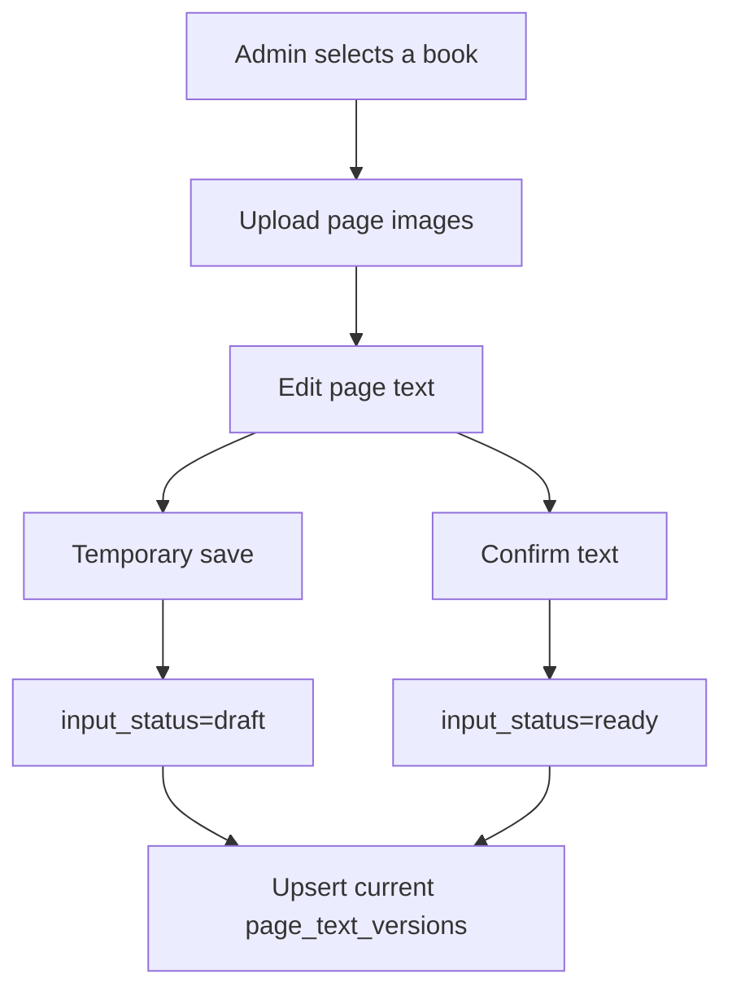
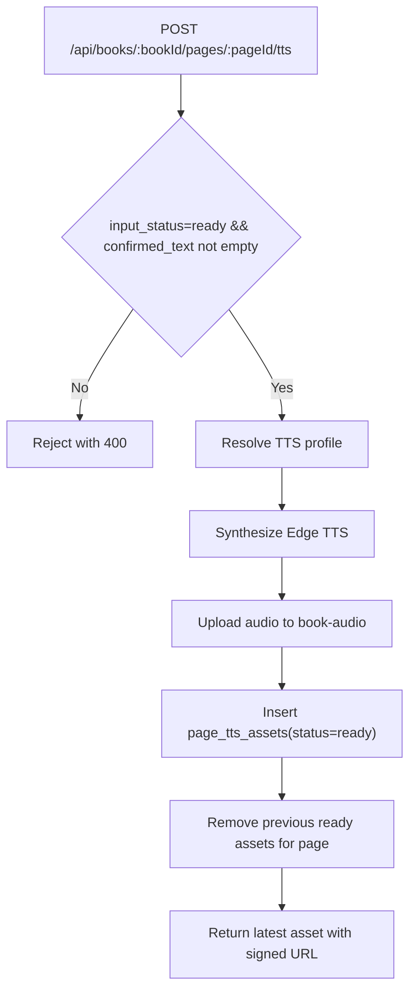
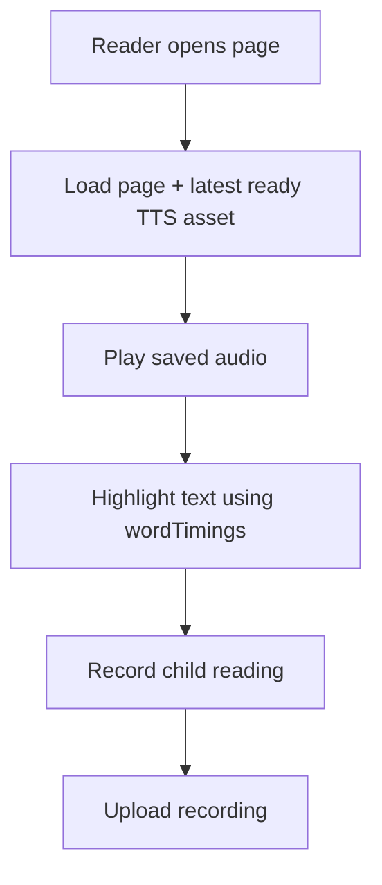
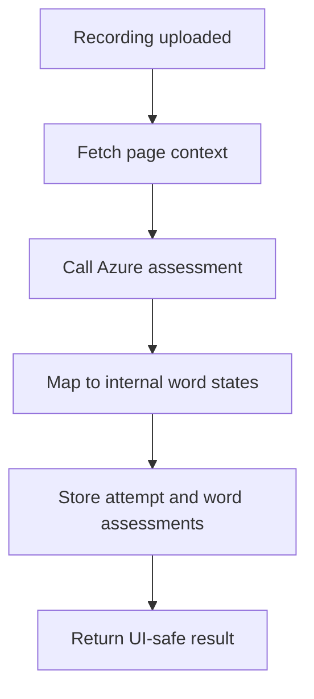

# Process Flows

## Purpose

Describe user flow and backend flow with explicit state transitions.
Use this document to validate feature behavior and API sequencing.

## Scope

Included:

- Admin authoring flow
- Page TTS generation flow
- Reader playback flow
- Pronunciation assessment flow

Excluded:

- OCR automation details
- Parent analytics flow

## Flow 1. Admin Authoring

Rules:

- Empty text remains `input_status=empty`.
- Any saved text creates/updates current text-version context.
- Confirmed text is the only eligible source for TTS generation.

## Flow 2. Page TTS Generation (Edge)

Rules:

- Provider is selected by `TTS_PROVIDER` (`edge|google|azure`), with current runtime implementation on `edge`.
- Generation is page-level, not sentence-level.
- Replacement semantics: keep one active ready asset per page.

## Flow 3. Reader Session Playback

Rules:

- Reader must use persisted `ready` TTS asset data.
- Highlight derives from the same asset timing metadata.

## Flow 4. Pronunciation Assessment

## Cross-Flow State Rules

- `book_pages.input_status`: `empty -> draft -> ready`
- `page_tts_assets.status`: `pending -> ready` or `failed`
- `reading_attempts.status`: `uploaded -> assessed` or `failed`

## Invariants

- TTS generation is blocked unless page text is confirmed.
- TTS and assessments must remain linked to current page/text context.
- Playback and highlight must rely on the same generated TTS asset.

## Acceptance Criteria

- Each flow has a clear start/end contract and state transition.
- API and UI boundaries match this flow document.
- When flow behavior changes, this document is updated in the same change.

## Out Of Scope

- Admin role-management flow
- Parent reporting flow
- OCR batch pipeline
