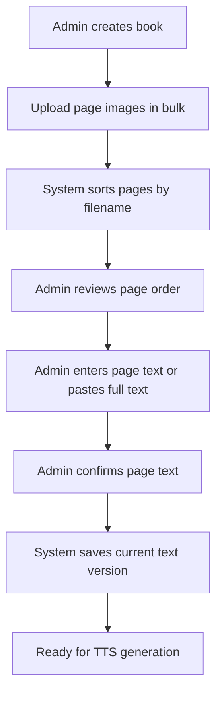
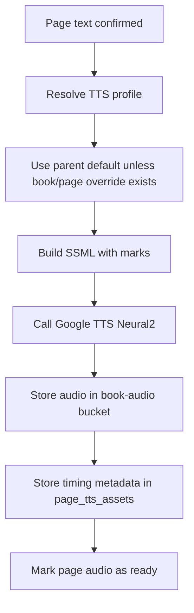
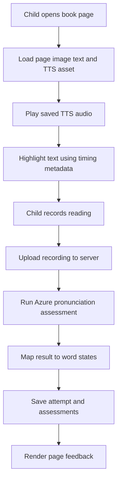
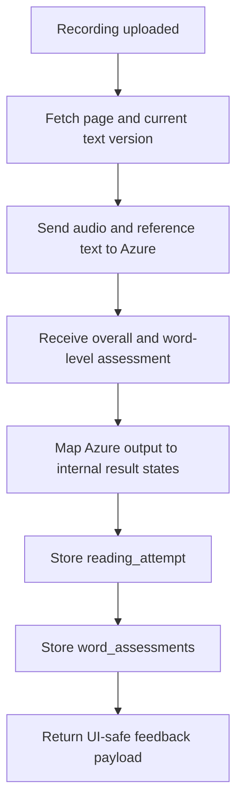

# Process Flows

## Purpose

이 문서는 핵심 사용자 흐름과 시스템 처리 흐름을 시각적으로 정의한다.  
구현 중 작업 순서, 책임 경계, 상태 전이를 판단할 때 이 문서를 기준으로 삼는다.

## Scope

포함:

- 관리자 책 등록 플로우
- 페이지 TTS 생성 플로우
- 아이 읽기 세션 플로우
- 발음 평가 플로우

제외:

- OCR 자동화 확장 플로우 상세
- 부모 통계/리포트 플로우

## Flow 1. 관리자 책 등록

핵심 규칙:

- 이미지는 배치 업로드가 기본이다
- 페이지 텍스트는 수동 확정이 기준이다
- OCR은 이 플로우의 필수 단계가 아니다

## Flow 2. 페이지 TTS 생성

핵심 규칙:

- TTS는 실시간 기본 호출이 아니라 사전 생성이다
- 프리셋 변경 시 영향 받는 페이지 자산만 재생성한다
- 정식 오디오는 `text_version`과 `tts_profile`이 확정된 뒤에만 생성한다

## Flow 3. 아이 읽기 세션

핵심 규칙:

- 읽기 화면은 저장된 오디오를 우선 사용한다
- 브라우저 내장 STT는 평가 기준으로 사용하지 않는다
- 페이지 결과는 단어 상태까지 저장 가능해야 한다

## Flow 4. 발음 평가 상세

내부 상태 매핑 예:

- Azure result -> `correct`
- Low confidence but matched -> `partial`
- Omission -> `missed`
- Mispronunciation or mismatch -> `wrong`
- Insertion -> `inserted`

## Cross-Flow State Rules

- `book_pages.input_status`는 `empty -> draft -> ready` 순서를 따른다
- `page_tts_assets.status`는 `pending -> ready` 또는 `failed`를 따른다
- `reading_attempts.status`는 `uploaded -> assessed` 또는 `failed`를 따른다

## Invariants

- 관리자 수동 확정 없이 정식 콘텐츠 상태로 승격하지 않는다
- TTS와 평가는 반드시 현재 텍스트 버전에 연결되어야 한다
- 단어 하이라이트와 평가 결과는 동일한 페이지/텍스트 기준을 공유해야 한다
- 읽기 세션은 한 페이지 단위로 독립 저장 가능해야 한다

## Acceptance Criteria

- 각 핵심 기능이 어떤 입력에서 시작해 어떤 저장 결과로 끝나는지 명확해야 한다
- 구현자가 flow 기준으로 API와 UI 경계를 나눌 수 있어야 한다
- 새 기능이 기존 핵심 플로우를 깨면 설계 문서를 같이 수정해야 한다

## Out Of Scope

- 관리자 권한 승인 워크플로우
- 부모 리포트 생성 플로우
- 배치 OCR 파이프라인

